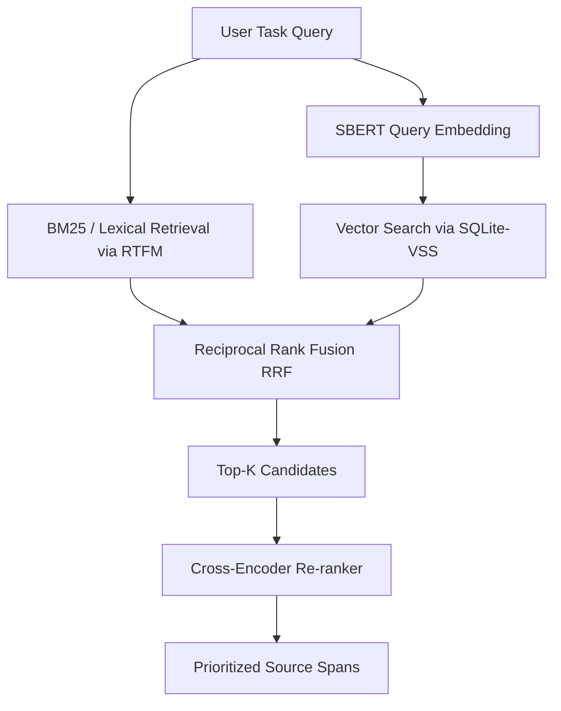

# Future Optimizations: Semantic Retrieval & Advanced Architecture

This document outlines future iteration plans for introducing transformer-based semantic retrieval to the `writing-context-rtfm` codebase, alongside other high-value architectural optimizations.

---

## 1. BERT-Based Semantic Retrieval & Hybrid Search

The current search mechanism relies entirely on RTFM's lexical query matcher. While fast and precise for exact keyword lookups, it misses semantic synonyms and paraphrase alignments (e.g., matching "performance bottleneck" with "database slowdown").

To address this, we propose a **Hybrid Retrieval (Sparse + Dense)** architecture using local transformer models.

### Proposed Architecture



### Component Details

#### A. Dense Embedding Retrieval (Bi-Encoder)
*   **Pluggable Drivers**: Supports both local CPU/GPU execution and remote cloud APIs.
*   **Model Selection**:
    *   *Local (Maximum Accuracy)*: `BAAI/bge-base-en-v1.5` (768-dimensional vectors) or `BAAI/bge-small-en-v1.5` (384-dimensional vectors).
    *   *API-Based (Zero-Footprint)*: Gemini `text-embedding-004` or OpenAI `text-embedding-3-small`.
    *   *Local (Baseline)*: `sentence-transformers/all-MiniLM-L6-v2` (384-dimensional dense vectors).
*   **Storage**: Leverage `numpy` for blazing-fast, zero-dependency in-memory cosine similarity, storing vectors as raw BLOBs in the existing `.writing-context/context_cache.sqlite` database. This avoids complex C++ extension compilation (`sqlite-vss`) across different OS platforms.
*   **Index Construction**:
    *   During RTFM synchronization, trigger a background worker (or lazy-load on fetch) to read chunks from RTFM and compute dense embeddings.
    *   Store vector blobs alongside chunk metadata in standard SQLite tables and load into `numpy` memory maps on query.

#### B. Reciprocal Rank Fusion (RRF)
To combine BM25 scores (lexical) and cosine similarities (dense) without calibrating distinct scale systems, apply Reciprocal Rank Fusion:
$$\text{RRF Score}(d \in D) = \sum_{m \in \{\text{lexical}, \text{dense}\}} \frac{1}{k + r_m(d)}$$
Where $r_m(d)$ is the rank of document/chunk $d$ in the retriever $m$, and $k$ is a constant (typically $60$) that mitigates the impact of low-ranked outliers.

#### C. Cross-Encoder Re-ranking (Deep Mode / Maximum Accuracy)
For the `"deep"` packing mode, pass the top-ranked hybrid results to a Cross-Encoder to compute full cross-attention:
*   **Model Selection**:
    *   *Local (Maximum Accuracy)*: `BAAI/bge-reranker-v2-m3` (handles multilingual text, spelling variations, and up to 8k context length) or `mixedbread-ai/mxbai-rerank-large-v1` (highly optimized for English).
    *   *API-Based (Zero-Footprint)*: Cohere Rerank v3 (`rerank-english-v3.0` / `rerank-multilingual-v3.0`).
    *   *Local (Baseline)*: `cross-encoder/ms-marco-MiniLM-L-6-v2`.
*   **Filtering**: Compute cross-attention between `(Query, Candidate Chunk)` to get an absolute relevance probability. Filter out any chunks falling below a threshold (e.g., $< 0.35$).

#### D. Configuration Schema (`.writing-context/config.yaml`)
To support switching between local lightweight configurations and maximum-accuracy environments, the following schema will be used:
```yaml
retrieval:
  hybrid_search:
    enabled: true
    dense_weight: 0.5
    sparse_weight: 0.5
    
  embedding:
    provider: local  # options: local, gemini, openai
    model_name: "BAAI/bge-base-en-v1.5" # 768-dimensional, high accuracy
    
  reranker:
    enabled: true
    provider: local  # options: local, cohere, jina
    model_name: "BAAI/bge-reranker-v2-m3" # 8k context, SOTA accuracy
```

---

## 2. LaTeX AST Parsing & Reference Graph

Regex patterns inside `utils.py` are prone to false positives/negatives in complex LaTeX environments (e.g., nested brackets, macro-definitions). Replacing them with a dedicated AST parser will improve reliability.

### Implementation Plan
1.  **Introduce AST Dependency**: Use `TexSoup` (a lightweight pythonic parser for LaTeX) or implement a custom lightweight token-based parser if we want to minimize runtime dependencies.
2.  **Generate Dependency Mapping**:
    *   Build a complete graph of the manuscript by matching `\label{key}` to all corresponding `\ref{key}`, `\cref{key}`, or `\cite{key}` references.
    *   Map `\input{filename}` and `\include{filename}` to build the physical file hierarchy.
3.  **Automatic Section Card Scaffolding**:
    *   Update `initialize_section_cards` to automatically populate the `depends_on` metadata by mapping references across section boundaries. For instance, if `section_results.tex` contains a `\ref{fig:method}` defined in `section_method.tex`, establish a dependency relationship automatically.

---

## 3. Cache Compression

Currently, the SQLite database stores context pack payloads as raw JSON strings. As run histories accumulate, SQLite DB file sizes scale up rapidly.

### Implementation Plan
1.  **Surgical Compression**: Compress `payload_json` in `context_pack_payloads` using Python's standard `zlib` or `lzma` libraries.
2.  **Database Schemas Adaptation**:
    *   Store data as `BLOB` instead of `TEXT`.
    *   Wrap read/write operations in the `ExtensionStore` with transparent compression/decompression helpers:
        ```python
        def _compress(data: str) -> bytes:
            return zlib.compress(data.encode("utf-8"), level=6)


        def _decompress(blob: bytes) -> str:
            return zlib.decompress(blob).decode("utf-8")
        ```

---

## 4. Parallelized LLM Evaluation (A/B Testing Runner)

To evaluate context pack quality improvements dynamically, the extension needs a faster offline evaluation pipeline.

### Implementation Plan
1.  **Concurrent Execution**: Leverage `asyncio` combined with a connection pool to run evaluations concurrently against LLM inference APIs (e.g., Gemini or OpenAI endpoints).
2.  **A/B Test Design**:
    *   Generate a set of task runs.
    *   Run parallel evaluations: Group A (Lexical Context Pack) vs. Group B (Hybrid/Semantic Context Pack).
    *   Compute and store evaluation statistics (such as token savings, semantic coverage, hallucination rate) in the `evaluation_records` SQLite table.
