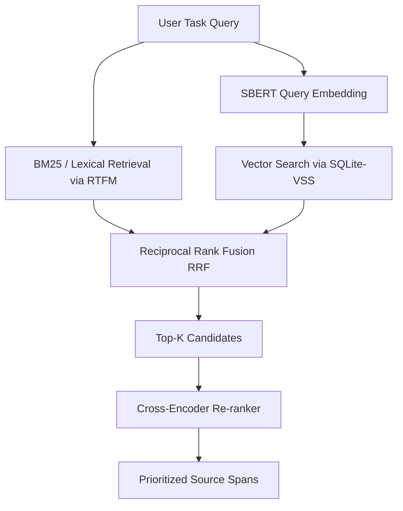

# Future Optimizations: Semantic Retrieval & Advanced Architecture

This document tracks experimental transformer-based semantic retrieval in the `writing-context-rtfm` codebase, alongside other high-value architectural optimizations.

---

## 1. BERT-Based Semantic Retrieval & Hybrid Search

The current search mechanism relies entirely on RTFM's lexical query matcher. While fast and precise for exact keyword lookups, it misses semantic synonyms and paraphrase alignments (e.g., matching "performance bottleneck" with "database slowdown").

To address this, we propose a **Hybrid Retrieval (Sparse + Dense)** architecture using local transformer models.

### Experimental Architecture



### Component Details

#### Evaluation Candidates for v0.11.0

The first local evaluation compared two embedding tiers and one optional reranker:

* **Quality-oriented embedding model**: `mixedbread-ai/mxbai-embed-large-v1`.
* **Lightweight embedding model**: `sentence-transformers/all-MiniLM-L6-v2`.
* **Optional deep reranker**: `Alibaba-NLP/gte-reranker-modernbert-base`, applied only to a bounded top candidate set.

These are experimental 0.11.0 options, not enabled release defaults. Selection should be based on required-evidence coverage, irrelevant-source rate, warm-query latency, memory use, and the amount of manual context repair needed in personal writing tasks. Exact citation keys, labels, references, equations, and protected numeric values must continue to bypass semantic matching.

#### Current experimental status

The opt-in implementation is complete, but local canary work did not justify an always-on default.
Use MiniLM as the practical CPU candidate. Apply ModernBERT only to a bounded candidate set when the
extra latency is acceptable, because reranking can improve noise filtering while changing useful
ordering. Revisit Mixedbread only with MPS/GPU, ONNX, TEI, or another optimized runtime; its CPU
indexing cost is not suitable for the default interactive workflow. All three options ship disabled
and explicitly experimental in 0.11.0. Promotion still requires repeatable improvements in required
evidence coverage and reduced manual context repair.

#### A. Dense Embedding Retrieval (Bi-Encoder)
*   **Pluggable Drivers**: Supports both local CPU/GPU execution and remote cloud APIs.
*   **Model Selection**:
    *   *Local (Quality Candidate)*: `mixedbread-ai/mxbai-embed-large-v1`.
    *   *Local (Lightweight Candidate)*: `sentence-transformers/all-MiniLM-L6-v2`.
*   **Storage**: Leverage `numpy` for blazing-fast, zero-dependency in-memory cosine similarity, storing vectors as raw BLOBs in the existing `.writing-context/context_cache.sqlite` database. This avoids complex C++ extension compilation (`sqlite-vss`) across different OS platforms.
*   **Index Construction**:
    *   Compute embeddings during an explicit foreground synchronization step. Do not launch detached or recursively restarting background workers.
    *   Store vector blobs alongside chunk metadata in standard SQLite tables, keyed by content hash, model identifier, model revision, and chunking-policy version.
    *   Load vectors in bounded batches or memory maps and guarantee model/process cleanup when synchronization finishes.

#### B. Reciprocal Rank Fusion (RRF)
To combine BM25 scores (lexical) and cosine similarities (dense) without calibrating distinct scale systems, apply Reciprocal Rank Fusion:
$$\text{RRF Score}(d \in D) = \sum_{m \in \{\text{lexical}, \text{dense}\}} \frac{1}{k + r_m(d)}$$
Where $r_m(d)$ is the rank of document/chunk $d$ in the retriever $m$, and $k$ is a constant (typically $60$) that mitigates the impact of low-ranked outliers.

#### C. Cross-Encoder Re-ranking (Deep Mode / Maximum Accuracy)
For the `"deep"` packing mode, pass the top-ranked hybrid results to a Cross-Encoder to compute full cross-attention:
*   **Model Selection**: Evaluate `Alibaba-NLP/gte-reranker-modernbert-base` as an optional deep-mode reranker.
*   **Filtering**: Rerank only a bounded lexical/dense candidate set. Calibrate any threshold on personal writing tasks; do not treat semantic relevance as proof that a factual, citation, numeric, or protected-content obligation is satisfied.

#### D. Configuration Schema (`.writing-context/config.yaml`)
The implemented opt-in schema is:
```yaml
providers:
  local_embeddings:
    enabled: false
    model: sentence-transformers/all-MiniLM-L6-v2
    device: cpu
    batch_size: 16
    torch_threads: 4
    min_score: 0.5
    sync_on_query: true

  local_reranker:
    enabled: false
    model: Alibaba-NLP/gte-reranker-modernbert-base
    device: cpu
    batch_size: 4
    torch_threads: 4
    max_length: 512
    candidate_limit: 40
    blend_weight: 0.25
```

Proofreading remains outside this hybrid path. Its exact target line range and adjacent paragraphs
are direct-read inputs; retrieval is used only for terminology examples and must be allowed to fail
without removing the target.

---

## 2. LaTeX AST Parsing & Reference Graph

Regex patterns inside `utils.py` are prone to false positives/negatives in complex LaTeX environments (e.g., nested brackets, macro-definitions). Replacing them with a dedicated AST parser will improve reliability.

### Implementation Plan
1.  **Introduce AST Dependency**: Use `TexSoup` (a lightweight pythonic parser for LaTeX) or implement a custom lightweight token-based parser if we want to minimize runtime dependencies.
2.  **Generate Dependency Mapping**:
    *   Build a complete graph of the manuscript by matching `\label{key}` to all corresponding `\ref{key}`, `\cref{key}`, or `\cite{key}` references.
    *   Map `\input{filename}` and `\include{filename}` to build the physical file hierarchy.
3.  **Automatic Section Card Scaffolding**:
    *   Update `initialize_section_cards` to automatically populate the `depends_on` metadata by mapping references across section boundaries. For instance, if `section_results.tex` contains a `\ref{fig:method}` defined in `section_method.tex`, establish a dependency relationship automatically.

---

## 3. Cache Compression

Currently, the SQLite database stores context pack payloads as raw JSON strings. As run histories accumulate, SQLite DB file sizes scale up rapidly.

### Implementation Plan
1.  **Surgical Compression**: Compress `payload_json` in `context_pack_payloads` using Python's standard `zlib` or `lzma` libraries.
2.  **Database Schemas Adaptation**:
    *   Store data as `BLOB` instead of `TEXT`.
    *   Wrap read/write operations in the `ExtensionStore` with transparent compression/decompression helpers:
        ```python
        def _compress(data: str) -> bytes:
            return zlib.compress(data.encode("utf-8"), level=6)


        def _decompress(blob: bytes) -> str:
            return zlib.decompress(blob).decode("utf-8")
        ```

---

## 4. Parallelized LLM Evaluation (A/B Testing Runner)

To evaluate context pack quality improvements dynamically, the extension needs a faster offline evaluation pipeline.

### Implementation Plan
1.  **Concurrent Execution**: Leverage `asyncio` combined with a connection pool to run evaluations concurrently against LLM inference APIs (e.g., Gemini or OpenAI endpoints).
2.  **A/B Test Design**:
    *   Generate a set of task runs.
    *   Run parallel evaluations: Group A (Lexical Context Pack) vs. Group B (Hybrid/Semantic Context Pack).
    *   Compute and store evaluation statistics (such as token savings, semantic coverage, hallucination rate) in the `evaluation_records` SQLite table.
