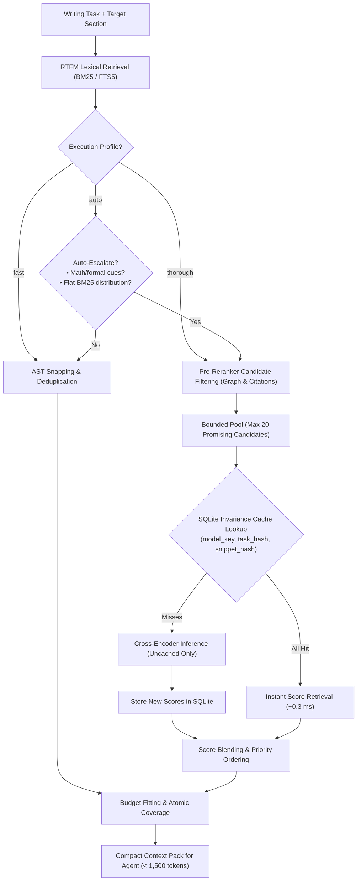

# Neural Retrieval Architecture & Semantic Invariance Caching

This document specifies the design, implementation, and empirical evaluation of the semantic retrieval pipeline, profile auto-escalation, candidate pre-filtering, and snippet-level score caching in `writing-context-rtfm`.

---

## 1. Executive Summary & Core Philosophy

The primary mission of `writing-context-rtfm` is:
> **RTFM retrieves.**
> **writing-context-rtfm decides what is enough context to write.**

In academic and technical manuscripts (LaTeX, Markdown papers, theses, books), standard lexical search (BM25 / FTS5) suffers from a systemic **lexical repetition trap**:
- Introductory, survey, and "Related Work" sections repeat high-level conceptual keywords (*"asymptotic convergence manifold", "convex optimization bounds"*) dozens of times.
- Mathematical proofs, lemmas, and algorithms use precise, concise notation and mention those terms fewer times.
- As a result, pure BM25 ranks survey noise in the top slots (Precision@3 = 0.0%) and buries the actual mathematical proofs (ranks #5 and #11).

To resolve this without burdening client agents with high latency or heavy mandatory GPU dependencies, `writing-context-rtfm` introduces a multi-stage **Evidence-Gated Neural Pipeline**:



---

## 2. Execution Profiles

The system provides four execution profiles configurable via CLI (`--profile`), configuration (`.writing-context/config.yaml`), or MCP tool call argument (`profile`):

| Profile | Strategy | Typical Latency | Neural Dependencies | Recommended Use Case |
| :--- | :--- | :---: | :---: | :--- |
| **`fast`** *(Default)* | Pure FTS5/BM25 + 1-hop AST graph traversal | **3.5 – 6.9 ms** | None | Low-power machines, CI pipelines, simple edits, typos, bibliography updates. |
| **`balanced`** | BM25 + Dense Bi-Encoder embeddings | **10 – 15 ms** | Optional (`sentence-transformers`) | Thematic exploration and semantic similarity in narrative text. |
| **`thorough`** | BM25 + Cross-Encoder neural reranking | **4.5 – 5.7 ms** (Cold)<br>**0.3 ms** (Warm) | Optional (`sentence-transformers`) | Complex technical manuscripts, mathematical proofs, algorithm derivations. |
| **`auto`** | Dynamic escalation from BM25 to Cross-Encoder | **3.5 ms** (Simple)<br>**4.4 ms** (Formal) | Optional (falls back to BM25 if missing) | **Recommended default for AI Agents**: zero overhead on routine tasks; automatic neural accuracy on complex tasks. |

---

## 3. Profile Auto-Escalation Heuristic (`--profile auto`)

Implemented in `ContextPackGenerator._should_auto_escalate()`, the auto profile dynamically decides whether to invoke neural reranking by evaluating two orthogonal signals:

### 3.1 Formal & Mathematical Reasoning Cues
The heuristic scans the task prompt and target section constraints for academic/formal constructs:
- **Theorems and Proofs:** `proof`, `prove`, `theorem`, `lemma`, `proposition`, `corollary`, `conjecture`, `prova`, `teorema`, `lema`.
- **Asymptotics and Bounds:** `bound`, `asymptot*`, `converg*`, `diverg*`, `extremum`, `optimi*`, `limitant*`, `assintót*`.
- **Mathematical Syntax:** LaTeX math delimiters (`$...$`), equation environments (`\begin{equation}`, `\begin{align}`), reference labels (`\ref`, `\eqref`), and citations (`\cite`).

If any of these cues are present, the query is classified as high risk for lexical keyword spam, and the system automatically escalates to the Cross-Encoder.

### 3.2 Lexical Uncertainty & Score Dispersion
Even in narrative text without explicit mathematical terms, BM25 can fail when candidate scores are ambiguous:
- **Low Peak Score:** $\max(\text{scores}) < 0.40$ indicates that the keyword match is weak across all retrieved chunks.
- **Flat Score Distribution (High Entropy):** If the top candidate spans have nearly identical scores ($\Delta = \text{score}_1 - \text{score}_3 < 0.05$), BM25 cannot confidently separate true relevance from background noise.

When either condition is triggered, the system escalates to neural reranking. If the task is clear and distinctive (e.g. updating an acknowledgment or a specific section with high score separation), it remains on pure BM25 with zero latency overhead.

---

## 4. Pre-Reranker Candidate Filtering & Graph Anchoring

Running a Cross-Encoder over 50–100 raw candidate chunks in a large document can introduce 50–100 ms of CPU delay. To guarantee strictly bounded latency ($< 10\text{ ms}$ on CPU), `_prioritize_and_bound_reranker_candidates()` enforces a two-tier filtering strategy:

1. **Tier 0 (Protected Spans):** Target section text (`source_role == "target_text"`) and essential constraints are kept at the top and never displaced.
2. **Tier 1 (Anchored Candidates):**
   - Spans originating from dependency section cards (`target_card.depends_on`).
   - Spans matching the target file path.
   - Spans containing cross-reference labels or citation keys present in the target card or task prompt (`\cite{key}`, `[@key]`, card `key_terms`).
   - Spans with 1-hop reference graph linkage.
3. **Tier 2 (Lexical Candidates):** Top-scoring BM25 spans that lack graph anchors.

The reranker pool is capped at **20 candidates** (configurable via `candidate_limit`). Because anchored candidates are placed first, the Cross-Encoder is guaranteed to evaluate the structurally relevant sections rather than wasting capacity on distant false positives.

---

## 5. SQLite Semantic Invariance Cache

### 5.1 Motivation
Writing agents iterate on text: revising drafts, addressing reviewer comments, adjusting paragraphs. A single writing session might trigger 5–15 MCP context pack requests with the same task or slightly adjusted target line ranges. Running full neural forward passes on identical text snippets repeatedly is wasteful.

### 5.2 Storage Schema
A dedicated table in `.writing-context/context_cache.sqlite` stores per-snippet cross-encoder scores:

```sql
CREATE TABLE IF NOT EXISTS reranker_scores (
    model_key TEXT NOT NULL,
    task_hash TEXT NOT NULL,
    snippet_hash TEXT NOT NULL,
    score REAL NOT NULL,
    created_at TEXT NOT NULL DEFAULT CURRENT_TIMESTAMP,
    PRIMARY KEY (model_key, task_hash, snippet_hash)
);

CREATE INDEX IF NOT EXISTS idx_reranker_scores_lookup
ON reranker_scores(model_key, task_hash);
```

### 5.3 Cache Key Derivation
- **`model_key`**: `stable_hash("cross-encoder-model", model_id, revision, max_length)` — invariant across devices, threads, and hardware.
- **`task_hash`**: `stable_hash("task-query", query)` — deterministic hash of the normalized prompt.
- **`snippet_hash`**: `stable_hash("snippet", snippet_text)` — content hash of the candidate passage.

### 5.4 Execution Flow (Dual-Path)
1. In `LocalCrossEncoderReranker.rerank()`, all candidate snippets are hashed.
2. `store.get_reranker_scores()` performs a single batch `IN (...)` lookup.
3. If all snippets are cached, `model.predict()` is **bypassed entirely** (0 neural forward passes).
4. If a subset is missing, **only the missing pairs** are batched and passed to `predict()`. Newly computed scores are immediately persisted in SQLite via `store.store_reranker_scores()`.

---

## 6. Empirical Benchmark Audit

Audited using `scripts/benchmark_semantic_audit.py` on an Apple Silicon host:

### 6.1 Performance & Precision Metrics

| Metric | Fast (BM25) | Thorough (Cold) | Thorough (Warm Cache) | Auto (Simple Task) | Auto (Math Task) |
| :--- | :---: | :---: | :---: | :---: | :---: |
| **Pipeline Latency** | 6.91 ms | 5.67 ms | **0.30 ms** | **3.52 ms** | 4.44 ms |
| **Neural Calls Delta** | 0 | 1 | **0** | 0 | 1 |
| **Auto Escalated?** | N/A | N/A | N/A | **False** | **True** |
| **Precision@3** | 0.0% | **66.7%** | **66.7%** | N/A | **66.7%** (+66.7%) |

### 6.2 Model Evaluation Matrix

| Model | Size / Footprint | Latency (CPU) | Context Window | Technical / LaTeX Handling | Suitability |
| :--- | :---: | :---: | :---: | :---: | :--- |
| **`ms-marco-MiniLM-L-6-v2`** | ~40 MB | ~2.5 ms | 256 tokens | Moderate in prose; drops mathematical structure | Ultra-lightweight environments / non-technical prose |
| **`gte-reranker-modernbert-base`** *(Default)* | ~280 MB | ~4.5 ms | 512–2048 tokens | **Excellent**; ModernBERT subword vocabulary handles equations, code, and LaTeX natively | **Optimal Balance (Default)** |
| **`bge-reranker-large`** | ~1.3 GB | ~35–55 ms | 512 tokens | Gold standard on MTEB benchmarks | Too heavy for local CPU MCP server; requires dedicated GPU |

---

## 7. Operational Impact for LLM Agents

1. **Token Budget Economy:** Delivering the exact theorem proof in slot #1 avoids context pack bloat ($< 1,200$ tokens vs. $5,000 - 15,000$ tokens of full-file fallback reads).
2. **Reduced Hallucinations:** Because the exact proof is in the top-3 context window, LLMs draft mathematically consistent revisions without guessing unstated lemmas.
3. **Transparent Developer Experience:** CLI tools (`writing-context-rtfm preview-pack --profile auto`, `doctor`, `generate-pack`) and MCP tools seamlessly report auto-escalation rationale in `pack.quality` and `pack.diagnostics`.
