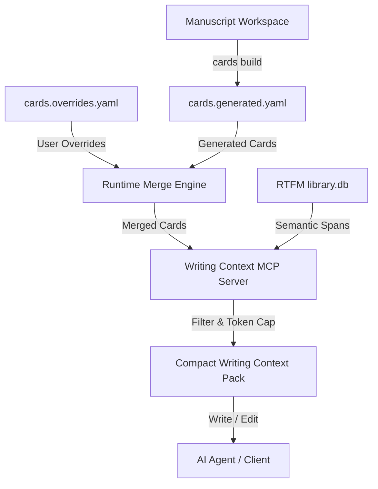

# writing-context-rtfm Workflow Guide & Reference

This guide outlines the standard workflow, commands, and Agent Rules of Engagement for the `writing-context-rtfm` MCP extension. It is designed to be read by both developers (to setup and configure projects) and AI agents (to guide text generation and self-correction).

---

## 1. Conceptual Overview

`writing-context-rtfm` is a lightweight Model Context Protocol (MCP) server that acts as a context decision layer on top of **RTFM** (which manages raw indexing and semantic retrieval).

* **RTFM** indexes and retrieves.
* **writing-context-rtfm** decides *what is enough context to write*, formats structured packs, checks LaTeX constraints, and enforces token budgets.



---

## 2. The Three Canonical Workflows

### 2.1 Fluxo 1: Primeiro Uso (First Use & Setup)

To start using `writing-context-rtfm` in a new or existing manuscript, setup takes less than a minute.

#### Step 1: Zero-Install or Global CLI
Choose between immediate execution with `uvx` (recommended for MCP clients) or global CLI installation:

```bash
# Option A: Zero-install via uvx (temporary runtime, no environment clutter)
uvx writing-context-rtfm doctor

# Option B: Global tool install via uv
uv tool install writing-context-rtfm

# Option C: Global tool install via pipx
pipx install writing-context-rtfm
```
*(Note: `rtfm-ai[embeddings]>=0.46.1` is bundled as an automatic dependency; no manual secondary installation of `rtfm-ai` is required).*

#### Step 2: One-Command Project Quickstart
Navigate to your manuscript directory and run:
```bash
writing-context-rtfm init --quickstart
```
This automated command:
1. Generates `.writing-context/config.yaml` with default token budgets and role weights.
2. Generates `.writing-context/cards.overrides.yaml.example` for human-controlled guidance.
3. Automatically appends the SQLite cache path to `.gitignore`.
4. Registers the MCP server entry into `.mcp.json`.
5. Injects AI safety rules into `CLAUDE.md`, `AGENTS.md`, and `GEMINI.md`.
6. Scans LaTeX files, parses `\input` structures, and scaffolds `.writing-context/cards.generated.yaml`.
7. Initializes the RTFM index directory and executes the initial synchronization (`library.db`).

*(If you prefer manual, step-by-step onboarding, run `writing-context-rtfm init`, then `writing-context-rtfm cards build`, followed by `writing-context-rtfm sync`).*

#### Step 3: Verify Environment Health with `doctor`
Run the diagnostic doctor to confirm everything is operational:
```bash
writing-context-rtfm doctor
```
Doctor validates:
- **Python**: Ensures version >= 3.13.
- **Dependencies**: Confirms core (`rtfm`, `mcp`, `yaml`, `pylatexenc`, `pathspec`) and optional packages.
- **Index**: Inspects `library.db`, chunk count, book count, and vector embeddings.
- **Zotero & BibTeX**: Discovers local `.bib` files, Zotero desktop storage, and `zotero-mcp` availability.
- **API Keys**: Verifies stored or environment credentials (OpenAI, Hugging Face, Anthropic).
- **Hardware & Models**: Detects CPU cores, GPU/Metal acceleration, and model caches.

#### Step 4: Register MCP in Your AI Editor
Configure your editor (Claude Desktop, Cursor, Cline, Claude Code) using `uvx writing-context-rtfm` or `writing-context-rtfm serve`.

---

### 2.2 Fluxo 2: Uso Diário (Daily Writing Workflow)

During daily authoring, `writing-context-rtfm` operates mostly autonomously through your AI writing agent:

#### 1. Invisible Context Retrieval
When writing, revising, or checking consistency in your manuscript, your AI agent automatically triggers the appropriate MCP tool:
- **Section Drafting / Revision**: The agent calls `get_writing_context_pack` passing the current task, target section file, and token budget. The server extracts the unbroken target section, snaps AST boundaries (equations, tables), discovers 1-hop cross-references (`\ref{}`), resolves local BibTeX/Zotero literature, and enforces terminology rules.
- **Line-Level Proofreading**: When asking the agent to proofread a paragraph, it calls `get_proofreading_context_pack(target_file="...", line_start=X, line_end=Y)`. This delivers an isolated prompt slice with strict glossary rules, avoiding open-ended search noise.

#### 2. Writing & LaTeX Safety
The author writes and edits naturally. When the agent generates edits, it adheres to the LaTeX Safety rules included in the context pack to prevent deleting labels, formulas, or citation anchors.

#### 3. Refreshing Context After Edits
When you add new chapters, write substantial text, or update your `.bib` library:
```bash
# Update the SQLite full-text search and embeddings index
writing-context-rtfm sync

# Update section cards if section headers, files, or dependencies changed
writing-context-rtfm cards update
```
*(Alternatively, ask your agent in chat to run the MCP `refresh_index` tool).*

#### 4. Terminology Audits
Before submitting your manuscript, check terminology consistency across all sections:
```bash
# Query a single term's definition and forbidden variants
writing-context-rtfm get-term "Context Pack"

# Or ask your agent to run audit_manuscript_terminology via MCP
```

---

### 2.3 Fluxo 3: Troubleshooting (Diagnóstico e Resolução de Problemas)

When something fails or returns unexpected context, follow this diagnostic procedure:

#### Step 1: Run Doctor
The primary diagnostic tool is `doctor`:
```bash
# Human-readable report with actionable hints
writing-context-rtfm doctor

# Machine-readable output for scripts or AI agents
writing-context-rtfm doctor --json
```

#### Step 2: Diagnostic & Resolution Matrix

| Symptom / Error | Root Cause | Safe Resolution |
| :--- | :--- | :--- |
| `[!] Python: Python 3.12 (Needs >= 3.13)` | Incompatible Python runtime | Install Python 3.13+ using `uv python install 3.13` or run with `uvx --python 3.13 writing-context-rtfm`. |
| `[!] Index: library.db missing or 0 chunks` | Retrieval index not built | Run `writing-context-rtfm sync` to index the manuscript files. |
| `[!] Cards: Target file does not exist` | Renamed or deleted LaTeX file | Run `writing-context-rtfm cards validate` to detect stale cards, or `writing-context-rtfm cards rebuild` to re-scan. |
| `[!] Zotero: connection refused` | Zotero Desktop is closed or not responding | Ensure Zotero Desktop is open. Note: Local `.bib` files continue working offline even if Zotero is unavailable. |
| `[!] Zotero: collection not found` | Typos in collection name in `config.yaml` | Check collection names under `providers.zotero.extra.collections`. Use the full `Parent / Child` path for nested collections. |
| Degraded context pack status (`status: degraded`) | Requested token budget too small for target | Increase the budget (e.g. `--budget 4000`), or allow elastic scaling (default). |
| Stale cached context packs | Manuscript files edited externally | Clear the cache with `writing-context-rtfm cache clear`. |
| Lingering background worker | Orphaned subprocesses from previous runs | Run `writing-context-rtfm cleanup` to terminate lingering PID registrations. |

---

### 2.4 Empty Repositories and Overleaf Workflows

Because `writing-context-rtfm` analyzes the LaTeX file structure of your project, onboarding requires files to exist locally:

#### A. Starting a New Project (Empty Repository)
If your repository is empty:
1. `writing-context-rtfm init` will run successfully, but `cards build` won't find any LaTeX files to parse.
2. Create your root LaTeX file (e.g., `main.tex`) and any modular sections (e.g., `sections/01_introduction.tex`).
3. Run `writing-context-rtfm cards build` to automatically build your `.writing-context/cards.generated.yaml`.

#### B. Working with Overleaf Manuscripts
If your manuscript is hosted on Overleaf, you must bridge it to your local environment for the local MCP server:
1. **Clone the Overleaf Project**:
   - *Direct Git Integration (Premium)*: Run `git clone https://git.overleaf.com/your-project-id`
   - *GitHub Sync (Free)*: Enable GitHub Sync inside Overleaf and clone the target GitHub repository locally.
   - *Manual Download*: Download the project ZIP from Overleaf, extract it, and run `git init` locally.
2. **Setup the extension**:
   - Run the onboarding sequence (`writing-context-rtfm init --quickstart` or step-by-step) inside the local folder.
3. **Synchronize Changes**:
   - Let your AI agent write files locally. Commit and push the changes back to Overleaf or GitHub to automatically sync your Overleaf project.

---

### 2.5 Architecture & Decoupling Reference
For details on how `writing-context-rtfm` isolates the `rtfm-ai` engine using the `RetrievalEngine` protocol and contract testing suite, refer to the [Architecture Boundaries Specification](architecture_boundaries.md).

---

## 3. Command Reference

| Command | Purpose | Key Arguments |
| :--- | :--- | :--- |
| `init` | Initial setup of configuration, gitignore, and agent guidelines. | None |
| `cards build` | Discovers files, infers metadata, and compiles section card structures. | None |
| `sync` | Manually updates the underlying RTFM index. | None |
| `pack` | Generates a context pack for draft/revise tasks. | `--task`, `--target`, `--budget`, `--pack-mode` |
| `proofread-pack` | Generates a context pack optimized for grammar/style edits. | `target_file`, `--line-start`, `--line-end`, `--max-tokens` |
| `doctor` | Runs diagnostic health checks on databases and configuration files. | None |

---

## 4. Agent Rules of Engagement

AI agents working in a repository equipped with `writing-context-rtfm` adhere to a two-tier protocol:

### A. Two-Tier Retrieval Protocol (Soft Gatekeeping)
* **Tier 1 (Curated Context First)**: Always call `get_writing_context_pack` or `get_proofreading_context_pack` before drafting, rewriting, expanding, or proofreading text to obtain section constraints, thesis, terminology definitions, and 1-hop reference graph snippets.
* **Tier 2 (Autonomous Direct-Read Fallback)**: If you need continuous prose flow, full-chapter narrative context, or the returned context pack is truncated, you are fully authorized to read the target and dependency files directly after inspecting the pack.

### B. Handle LaTeX Safety Triggers
* **Rule**: Inspect the returned `warnings` array in the context pack.
* **Rule**: If a warning begins with `LaTeX Safety:`, pay extreme attention to the listed environments and labels (e.g. `\begin{equation} ... \end{equation}`, `\ref{...}`, `\cite{...}`). You **must not** delete or break these LaTeX markers during edits.

### C. Self-Correct Token Budgets & Elastic Scaling
* **Rule**: Put each concrete required idea, fact, literal, or citation key in `must_consider` and inspect `quality.atomic_coverage` before drafting.
* **Rule**: The generator automatically scales undersized budgets once to fit mandatory target text and atomic evidence, bounded by `context.max_token_budget`. This replaces repeated retrieval loops for evidence already present in the candidate pool.
* **Rule**: Retrieval quality has priority over token savings in elastic mode. Use `strict_budget=true` only for a genuine external hard limit.
* **Rule**: If coverage remains incomplete, use `request_more_context` or directly read the target dependencies named by the pack before drafting.

---

## 5. Simulation & Verification

To verify that the MCP server operates correctly in your workspace:

1. Generate a standard writing context pack:
   ```bash
   writing-context-rtfm pack --task "write introduction" --target sections/introduction.tex --budget 2000
   ```
2. Run again to confirm SQLite caching speeds up subsequent retrievals:
   ```json
   "cache": {
     "enabled": true,
     "hit": true
   }
   ```
3. Run with a highly restricted budget to verify the self-correction warning triggers:
   ```bash
   writing-context-rtfm pack --task "write introduction" --target sections/introduction.tex --budget 150
   ```
   *Expected output:* `"status": "degraded"` with warning containing `To resolve this, call the tool with a larger token_budget of at least 1150.`
