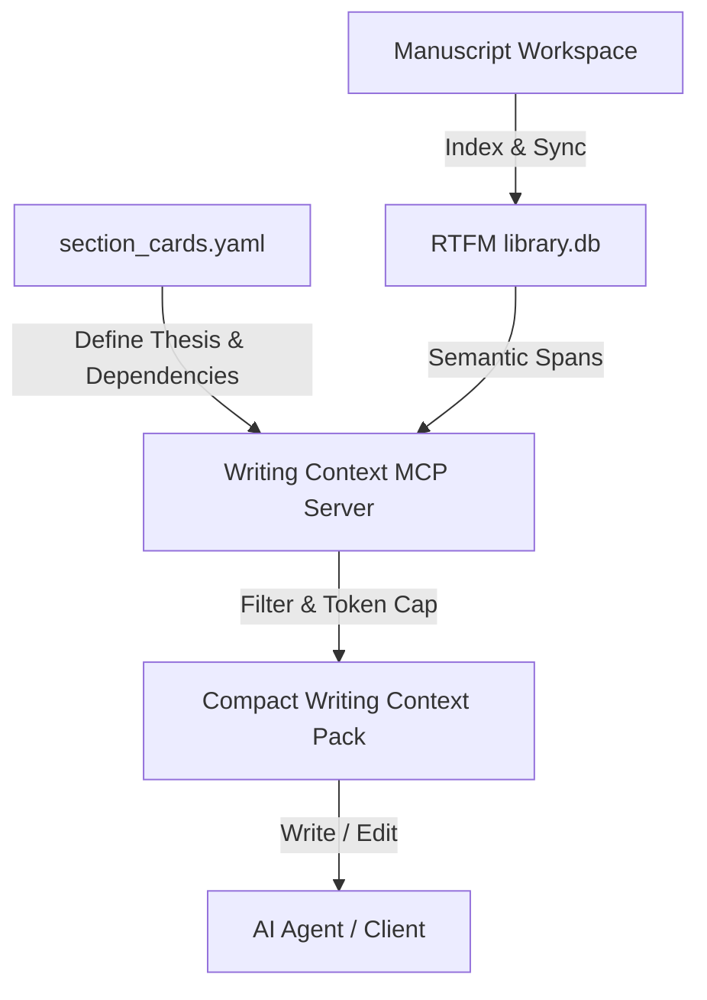

# writing-context-rtfm Workflow Guide & Reference

This guide outlines the standard workflow, commands, and Agent Rules of Engagement for the `writing-context-rtfm` MCP extension. It is designed to be read by both developers (to setup and configure projects) and AI agents (to guide text generation and self-correction).

---

## 1. Conceptual Overview

`writing-context-rtfm` is a lightweight Model Context Protocol (MCP) server that acts as a context decision layer on top of **RTFM** (which manages raw indexing and semantic retrieval).

* **RTFM** indexes and retrieves.
* **writing-context-rtfm** decides *what is enough context to write*, formats structured packs, checks LaTeX constraints, and enforces token budgets.



---

## 2. Setup and Project Onboarding

To integrate the extension into a manuscript project, follow this setup sequence:

### Step 1: Install the Package
Ensure the package is installed in the target Python environment:
```bash
uv pip install writing-context-rtfm
```

### Step 2: Initialize Configuration and Rules
Run the initialization command at the root of your project:
```bash
writing-context-rtfm init
```
This command non-destructively initializes:
1. **`.writing-context/config.yaml`**: The main configuration pointing to the RTFM corpus.
2. **`.writing-context/section_cards.yaml`**: A placeholder metadata file.
3. **`.gitignore`**: Append `.writing-context/context_cache.sqlite` to prevent tracking of local runs.
4. **`.mcp.json`**: An MCP server registry configuration for integration into editors.
5. **`CLAUDE.md` / `AGENTS.md` / `GEMINI.md`**: Guidelines appended with the **Agent Rules of Thumb** block.

### Step 3: Scaffold Section Cards
Generate the dependency mapping automatically by scanning LaTeX files:
```bash
writing-context-rtfm init-cards
```
This scans all `.tex` and `.md` files, parses LaTeX `\input` structures and label references, and registers sections with their automatic `depends_on` links inside `.writing-context/section_cards.yaml`.

### Step 4: Install the RTFM CLI (Retrieval Engine)
Since this extension uses RTFM to search and index files, ensure you install `rtfm-ai` globally or in your virtual environment:
```bash
# Global installation (recommended)
uv tool install rtfm-ai

# Or in a local project environment
uv pip install "rtfm-ai[embeddings]"
```

### Step 5: Initialize and Sync the RTFM Index
To enable semantic and keyword retrieval, initialize the RTFM configuration and perform the initial file synchronization:
```bash
# 1. Initialize the RTFM directory (.rtfm/)
rtfm init

# 2. Sync the project files to generate the local chunk database and embeddings
rtfm sync
```
* **Embedding Model**: By default, RTFM automatically generates embeddings for all document chunks. It uses a fast, lightweight multilingual model (`sentence-transformers/paraphrase-multilingual-MiniLM-L12-v2`) which runs completely locally on your CPU/GPU and downloads automatically from Hugging Face on the first sync. No external API keys are required.
* **Customizing Models**: You can customize the model by running the embedding step explicitly with a model alias (e.g., `fast`, `balanced`, or `quality`) or any Hugging Face model path:
  ```bash
  # Generate embeddings using the balanced model (BAAI/bge-base-en-v1.5)
  rtfm embed --embed-model balanced
  ```

### 2.1 Empty Repositories and Overleaf Workflows

Because `writing-context-rtfm` analyzes the LaTeX file structure of your project, onboarding requires files to exist locally:

#### A. Starting a New Project (Empty Repository)
If your repository is empty:
1. `writing-context-rtfm init` will run successfully, but `init-cards` won't find any LaTeX files to parse.
2. Create your root LaTeX file (e.g., `main.tex`) and any modular sections (e.g., `sections/01_introduction.tex`).
3. Run `writing-context-rtfm init-cards` to automatically build your `.writing-context/section_cards.yaml`.

#### B. Working with Overleaf Manuscripts
If your manuscript is hosted on Overleaf, you must bridge it to your local environment for the local MCP server:
1. **Clone the Overleaf Project**:
   - *Direct Git Integration (Premium)*: Run `git clone https://git.overleaf.com/your-project-id`
   - *GitHub Sync (Free)*: Enable GitHub Sync inside Overleaf and clone the target GitHub repository locally.
   - *Manual Download*: Download the project ZIP from Overleaf, extract it, and run `git init` locally.
2. **Setup the extension**:
   - Run the onboarding sequence (`writing-context-rtfm init`, `init-cards`, `rtfm init`, and `rtfm sync`) inside the local folder.
3. **Synchronize Changes**:
   - Let your AI agent write files locally. Commit and push the changes back to Overleaf or GitHub to automatically sync your Overleaf project.

---

## 3. Command Reference

| Command | Purpose | Key Arguments |
| :--- | :--- | :--- |
| `init` | Initial setup of configuration, gitignore, and agent guidelines. | None |
| `init-cards` | Discovers files and automatically maps out section card dependencies. | None |
| `sync` | Manually updates the underlying RTFM index. | None |
| `pack` | Generates a context pack for draft/revise tasks. | `--task`, `--target`, `--budget`, `--pack-mode` |
| `proofread-pack` | Generates a context pack optimized for grammar/style edits. | `target_file`, `--line-start`, `--line-end`, `--max-tokens` |
| `doctor` | Runs diagnostic health checks on databases and configuration files. | None |

---

## 4. Agent Rules of Engagement

AI agents working in a repository equipped with `writing-context-rtfm` **MUST** adhere to the following workflow:

### A. Context First
* **Rule**: Always call `get_writing_context_pack` (via MCP) or `writing-context-rtfm pack` (via CLI) before starting any manuscript writing, rewriting, expanding, or revision task.
* **Rule**: Do not read the entire repository or open arbitrary files. Trust the context pack to provide the necessary background context.

### B. Handle LaTeX Safety Triggers
* **Rule**: Inspect the returned `warnings` array in the context pack.
* **Rule**: If a warning begins with `LaTeX Safety:`, pay extreme attention to the listed environments and labels (e.g. `\begin{equation} ... \end{equation}`, `\ref{...}`). You **must not** delete or break these LaTeX markers during edits.

### C. Self-Correct Token Budgets
* **Rule**: Check the `status` field in the context pack. If the status is `"degraded"`, it means critical source context was dropped because the token budget was too small.
* **Rule**: Inspect the `warnings` array. Parse the warning to extract the recommended minimum budget:
  * For writing packs (`pack`), look for: `To resolve this, call the tool with a larger token_budget of at least X.`
  * For proofreading packs (`proofread-pack`), look for: `To resolve this, call the tool with a larger max_tokens value of at least X.`
* **Rule**: Automatically retry the call with the new recommended value (`token_budget` or `max_tokens` set to `X` or higher) before proceeding with manuscript generation.

---

## 5. Simulation & Verification

To verify that the MCP server operates correctly in your workspace:

1. Generate a standard writing context pack:
   ```bash
   writing-context-rtfm pack --task "write introduction" --target sections/introduction.tex --budget 2000
   ```
2. Run again to confirm SQLite caching speeds up subsequent retrievals:
   ```json
   "cache": {
     "enabled": true,
     "hit": true
   }
   ```
3. Run with a highly restricted budget to verify the self-correction warning triggers:
   ```bash
   writing-context-rtfm pack --task "write introduction" --target sections/introduction.tex --budget 150
   ```
   *Expected output:* `"status": "degraded"` with warning containing `To resolve this, call the tool with a larger token_budget of at least 1150.`
