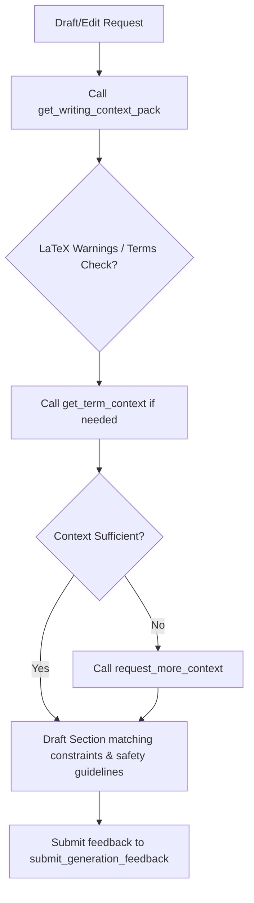

# MCP Agent Instructions: writing-context-rtfm

This project uses `writing-context-rtfm` to supply context packs and constraints. **Always** call these tools before writing/refining manuscript sections to minimize token count, align with the document's thesis, and respect constraints.

---

## 1. Tool Reference

| Tool Name | When to Use | Key Arguments |
|:---|:---|:---|
| `get_writing_context_pack` | Before drafting, revising, or review. | `task`, `target`, `token_budget`, `task_type`, `pack_mode`, `role_budgets`, `strict_budget`, `line_start`, `line_end` |
| `get_proofreading_context_pack` | Before proofreading/editing lines. | `target_file`, `line_start`, `line_end`, `mode`, `strictness`, `max_tokens` |
| `get_term_context` | Check definitions/avoid variants for a term. | `term` (case-insensitive lookup), `project_root` |
| `request_more_context` | Expand context when the budget was too tight. | `run_id` (from previous pack), `limit` (max 5) |
| `submit_generation_feedback` | Log context quality evaluations. | `run_id`, `metric_name`, `metric_value`, `metric_text` |
| `initialize_section_cards` | Scaffold YAML configs for untracked sections. | `project_root` |
| `audit_manuscript_terminology` | Verify key terms and flag semantic drift. | `project_root` |
| `inspect_target_section` | Read effective section metadata before changing cards. | `target`, `project_root` |
| `get_card_field_diff` | Compare generated, overridden, and effective card values. | `section_id`, `project_root` |
| `get_section_card_history` | Audit accepted, rejected, edited, and deleted card values. | `section_id`, `limit`, `project_root` |
| `refresh_index` | Re-sync the RTFM index after making edits. | `project_root`, `corpus` |

---

## 2. Advanced Parameters & Features

- **Task Types (`task_type`)**: Tailor search weights and strategies:
  - `"write_new_section"`, `"revise_existing_section"`, `"proofread"`, `"expand"`, `"condense"`, `"align_with_previous_sections"`, `"review"`.
- **Pack Modes (`pack_mode`)**: Choose token & depth levels:
  - `"minimal"`: budget cap 2k, bypasses keyword expansion, max 5 spans.
  - `"standard"`: default settings.
  - `"deep"`: max 35 spans, deep keyword lookups.
- **Role Budgets (`role_budgets`)**: Override fraction distribution per source role:
  - Roles: `"target_text"`, `"local_context"`, `"dependency"`, `"reference"`.
- **LaTeX Safety**:
  - Automatically identifies immutable commands (`\cite`, `\ref`, `\label`) and math structures.
  - Emits specific warnings for matched lines. **Do not** edit or alter these matches.

---

## 3. Prompts Reference

This MCP server implements native MCP Prompts. Call these via `prompts/get` to get fully hydrated prompts with context packs and thesis structures pre-formatted:

- **`write_section`**: For drafting or revising a specific section.
  - Arguments: `task`, `target`, `token_budget` (optional), `task_type` (optional), `pack_mode` (optional).
- **`proofread_section`**: For refining and correction.
  - Arguments: `target_file`, `line_start`, `line_end`, `mode` (optional), `strictness` (optional).

---

## 4. Workflow for Writing & Editing

1. **Get Context Pack**: Call `get_writing_context_pack` with the appropriate `target` section ID and `task_type`.
2. **Handle LaTeX warnings & constraints**: Carefully inspect returned `warnings` to preserve LaTeX structures. Respect `document_thesis` and section `constraints`.
3. **Verify Terms**: Call `get_term_context` to lookup definitions and avoid-terms.
4. **Draft with surgical focus**: Use the `source_spans` categorized by `source_role`. Do not read entire raw files unless pack `status` is `"degraded"`.
5. **Feed back**: Call `submit_generation_feedback` with `helpfulness=1.0` (helpful) or `hallucinations=1.0` to optimize caching.
